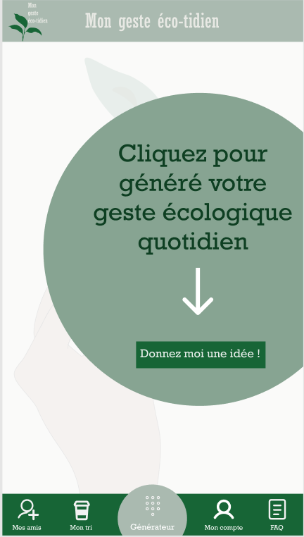
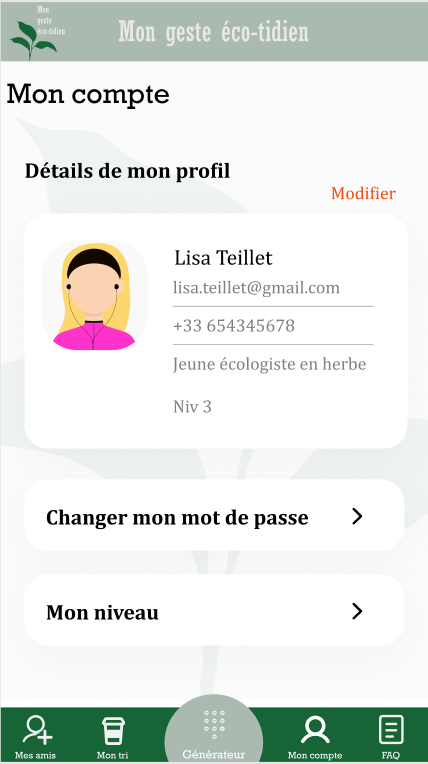
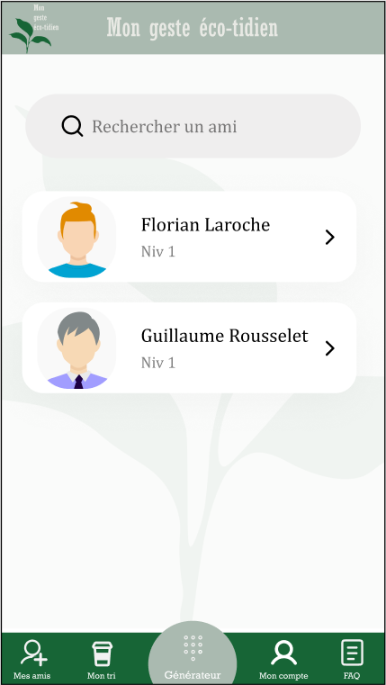
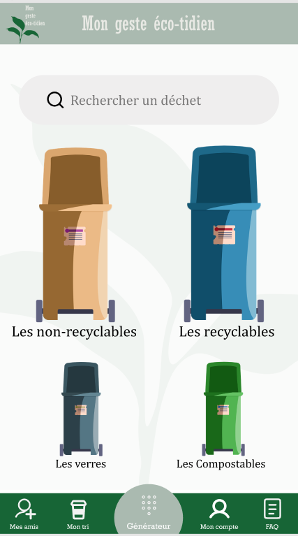

# Ecotidien

Dans le cadre du cours Informatique Mobile à l'Université du Québec à Chicoutimi nous avons eu l'idée de créer une application qui a pour théme l'écologie. L'application est réalisée grâce à Android Studio. 
Nous sommes deux étudiantes : Marion Brochet et Marine Favier

## Présentation de l'application

L'idée de départ de l'application est un générateur de geste écologique. L'utilisateur se retrouvera face à un générateur qu'il pourra actualiser pour avoir un geste écologique quoitidien d'où le nom éco-tidien.

## Ecran d'accueil

## Compte

Une fonctionnalité permet de gérer le compte de l'utilisateur. Il y a également une fonctionnalité pour voir le profil de nos amis. 

## Tri

Cette fonctionnalité est une aide pour faire le tri. Parfois, on ne sait pas si un emballage se met dans la poubelle de tri ou pas. 
Vous pourrez cliquer sur une poubelle et une liste affichera ce que la poubelle acceptera.

